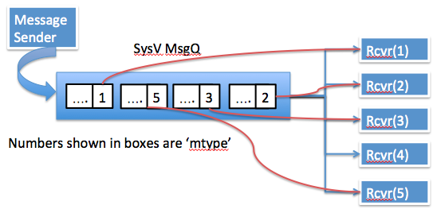

In project [Whitefield](https://github.com/whitefield-framework/whitefield), I
needed to select an IPC mechanism which could,
* Req#1: provide a way for a process to receive messages with specific type
  i.e. a message intended for the process based on some id.
* Req#2: a event based mechanism (such as poll/select/epoll) for receiving
  messages

## Use of 'mtype' in sysv msgq
[Sysv message queue](https://linux.die.net/man/7/svipc) support req#1 in a very
elegant manner. A message could be posted using a specific 'mtype' such that a
receiver process could call the interface
[msgrcv](https://linux.die.net/man/2/msgrcv) with that particular mtype to
receive only those marked messages, all on the same queue.

# Event based handling
Sysv msqq does not offer a descriptor which can be used in conjunction with
select/poll/epoll. This is rather a very big limiting factor for sysv msgqs.
Essentially if you want to handle sysv msgqs then you have to poll in msgrcv()
in non-blocking mode or block on msgrcv in a separate thread.

Posix msgq is touted to be very similar to sysv msgq and since it was designed
much later, it was assumed that posix msgqs provides all the important
functions provided by sysv msgq. Quote from Posix msgq man page 'man
mq_overview':

"This API is distinct from that provided by System V message queues (msgget(2),
msgsnd(2), msgrcv(2), etc.), but provides similar functionality."

In my case, I ended up using SysV message queues by blocking msgrcv in a
separate thread since the use of mtype was absolutely central to my design
requirement. I considered using sockets for the purpose, but it required me to
bind to different ports in case of UDP/TCP and it was difficult for me to
ascertain if the range of ports would be available on the target machine. I
also considered using Unix domain sockets, but again the handling of socket
files (and ensuring a writeable folder/path) was somthing i wanted to avoid.

Long story short, Posix message queues are not similar to SysV message queues
and Posix message queues may not have better functionality than SysV message
queues. There are still use-cases where SysV message queues makes sense.
