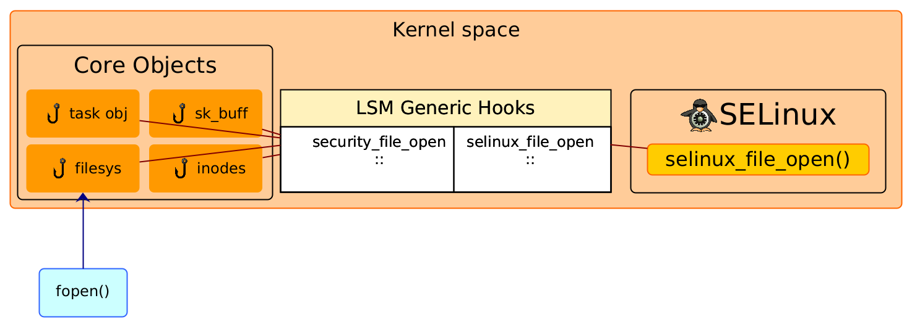

LSM hooks in Linux Kernel mediates access to internal kernel objects such as
inodes, tasks, files, devices, and IPC. LSMs, in general, refer to these generic
hooks added in the core kernel code. Further, security modules could make use
of these generic hooks to implement enhanced access control as independent
kernel modules. [AppArmor][AA], [SELinux][SEL], [Smack][SMACK], [TOMOYO][TOM]
are examples of such independent kernel security modules.

LSMs seeks to allow security modules to answer the question "May a **subject S**
perform a kernel **operation OP** on an internal kernel **object OBJ**?"

LSMs can drastically reduce the attack surface of a system if appropriate
policies using security modules are implemented.

## DACs vs. MACs

DAC (Discretionary Access Control) based access control is a means of
restricting access to objects based on the identity of subjects or groups. For
decades, Linux only had DAC-based access controls in the form of user and group
permissions. One of the problems with DACs is that the primitives are
transitive in nature. A user who is a privileged user could create other
privileged users, and that user could have access to restricted objects.

With MACs (Mandatory Access Control), the subjects (e.g., users, processes,
threads) and objects (e.g., files, sockets, memory segments) each have a set of
security attributes. These security attributes are centrally managed through
MAC policies. In the case of MAC, the user/group does not make any access decision,
but the access decision is managed by security attribute.

`LSMs are a form of MAC-based controls.`

LSM Hooks
---------

`LSM mediates access to kernel objects by placing hooks in the kernel code just
before the access.`


It can be seen here that the LSM hooks are applied after the DAC and other sanity checks are performed.



Here it is shown that the LSM hooks are applied in core objects, and these hooks
are dereferenced using a global hooks table. These global hooks are added (
e.g., [check apparmor
hooks](https://github.com/torvalds/linux/blob/7d6beb71da3cc033649d641e1e608713b8220290/security/apparmor/lsm.c#L1181)
when the security module is initialized.

## TOCTOU problem handling

LSMs are typically used for a system's policy enforcement. One school of thought
is that the enforcement can be handled in an asynchronous fashion, i.e., the kernel
audit events could pass the alert to userspace, and then the userspace could
enforce the decision asynchronously.

 of a file object is to be blocked, the
asynchronous nature might result in the unlink getting successful before the attack
could be blocked.

LSM hooks are applied inline to the kernel code processing; the kernel has
the security context and other details of the object while making the decision
inline. Thus the enforcement is inline to the access attempt, and any
blocking/denial action can be performed without TOCTOU problems.

## Security Modules currently defined in Linux kernel

LSMs are generic hooks, but if a new security module has to be introduced, the
new module can be operated as a kernel module. However, the introduction of a
new security module also requires changing the core-kernel code to introduce
this module to the kernel. There are already the following modules defined in
the default Linux kernel::

`$ grep -Hnrw "DEFINE_LSM" LINUX-KERNEL-SRC-CODE/`

```c
./security/smack/smack_lsm.c:4926:DEFINE_LSM(smack) = {
./security/tomoyo/tomoyo.c:588:DEFINE_LSM(tomoyo) = {
./security/loadpin/loadpin.c:246:DEFINE_LSM(loadpin) = {
./security/commoncap.c:1468:DEFINE_LSM(capability) = {
./security/selinux/hooks.c:7387:DEFINE_LSM(selinux) = {
./security/bpf/hooks.c:30:DEFINE_LSM(bpf) = {
./security/safesetid/lsm.c:264:DEFINE_LSM(safesetid_security_init) = {
./security/lockdown/lockdown.c:163:DEFINE_LSM(lockdown) = {
./security/integrity/iint.c:174:DEFINE_LSM(integrity) = {
./security/yama/yama_lsm.c:485:DEFINE_LSM(yama) = {
./security/apparmor/lsm.c:1905:DEFINE_LSM(apparmor) = {
```

In the above list, AppArmor and SELinux are undoubtedly the most widely used.
AppArmor is relatively easier to use, but SELinux provides the greater intensive
and fine-grained policy specification.
Linux POSIX.1e capabilities logic is also implemented as a security module.

There can be multiple security modules used at the same time. This is true in
most cases; the capabilities module is always loaded alongside SELinux or
any other LSM. The capabilities security module is always ordered first in
execution (controlled using (.order = LSM_ORDER_FIRST)
[https://github.com/torvalds/linux/blob/7d6beb71da3cc033649d641e1e608713b8220290/security/commoncap.c#L1470>]
flag).

However, note that AppArmor, SELinux, and Smack security modules initialize
themselves as exclusive (`LSM_FLAG_EXCLUSIVE`) security modules. There cannot
be two security modules in the system with `LSM_FLAG_EXCLUSIVE` flag set. Thus,
this means that one cannot have any two of the following (SELinux, AppArmor,
Smack) security modules registered simultaneously.

## Permissive hooks in LSMs

Certain POSIX-compliant filesystems depend on the ability to grant accesses that
would ordinarily be denied at a coarse level (DAC level) of granularity (check
[capabilities man page](https://man7.org/linux/man-pages/man7/capabilities.7.html) for
CAP_DAC_OVERRIDE). LSM supports DAC override (a.k.a., permissive hooks) for particular
objects such as POSIX-compliant filesystems, where the security module can
grant access the kernel was about to deny.

## Security Modules: A general critique

LSMs, as generic MAC-based security primitives, are very powerful. The security
modules allow the administrator to impose additional restrictions on the
system to reduce the attack surface. However, if the security module policy
specification language is hard to understand/debug, the administrator usually takes
a stance of disabling it altogether, thus imposing friction in adoption.

[AA]: https://en.wikipedia.org/wiki/AppArmor
[SEL]: https://en.wikipedia.org/wiki/SELinux
[TOM]: https://en.wikipedia.org/wiki/TOMOYO_Linux
[SMACK]: https://en.wikipedia.org/wiki/Smack_(Linux_security_module)
